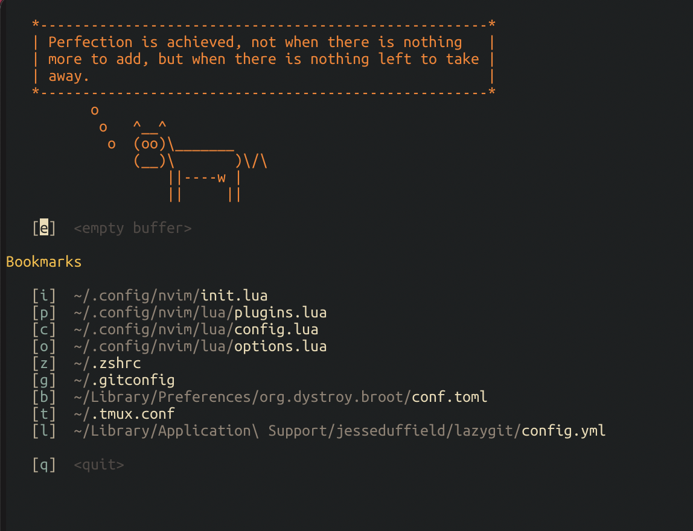

# dotfiles

Managed using [chezmio](https://www.chezmoi.io)

Includes dotfiles for [Neovim](https://neovim.io)

# to install / restore

You can install your dotfiles on new machine with a single command

`$ chezmoi init --apply https://github.com/mainendra/dotfiles.git`

# Screenshot

